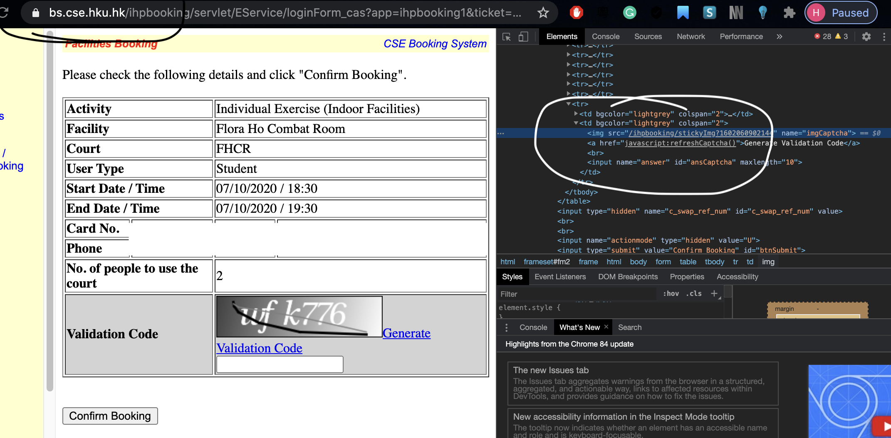
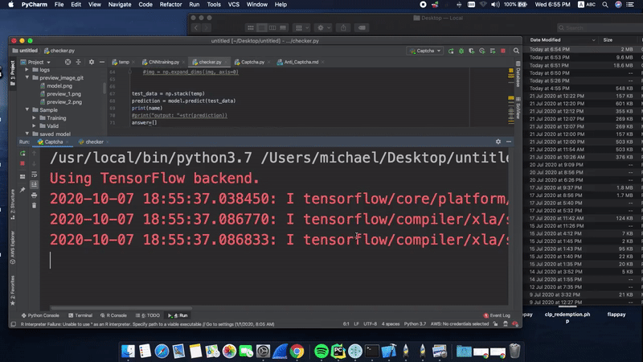
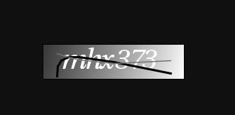
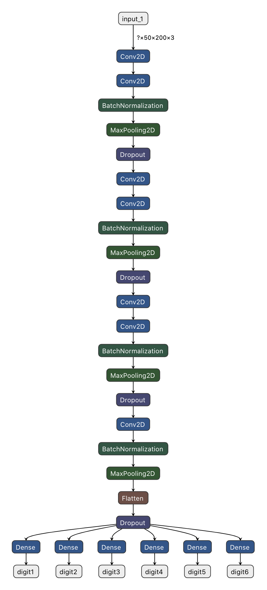

# Anti-Captcha
#### Breaking HKU CSE facility booking captcha validation by CNN model.

It is a captcha breaker developed to bypass [SimpleCaptcha] validation on `HKU portal - CSE booking system` by machine learning model.




This document will cover:
  - Methodology and Observation
  - Implementation with test
  - Magic (maybe)
  
  



# Observation and Methodology
By inspecting the captcha input column, it shows that the `SimpleCaptcha` is being used and it is a **dynamic captcha**, i.e.: *captcha changes by every web request*.
>Brutal forced or API cracking is impractical in this situation.

Machine learning, ideally CNN model, is purposed to use to bypass the captcha validation. However, it comes to a difficulty, **if it generates dynamic captcha, how can we get enough sample data (with ground true) to train the model automatically without developing a new GAN?**

Thanks to `SimpleCaptcha` open-source effort, sampling can be done by using generator in `SimpleCaptcha` library. 

By observation, HKU CSE seems to setting up with same format in every captcha:
- Constantly **6 digits only** with #FFF color
- fixed number of noise, **2 fixed color lines crossed the numbers** from random location
- fixed background gradient, **from #CCC - #FFF**




The generator now can by those parameters above to generate enough sample to the model.

### CNN Model
Consider the input image is given with *(50, 200, 3) shape*, and the complexity of the captcha is, as above shown, small. So there will be `3 blocks of (Conv layer + Conv layer + Max-pool layer)` each convolutional layer with *kernel_size (3, 3)* and `1 (Conv layer + Max-pool layer)`, combine with **6 output where corresponding to 6 digits** with `softmax` classififers (possibilities) each with `10 neurons` (0-9).

The model will be using ```accuracy``` as the only metric, ~~**goal is to predict the digits**, ```loss``` will be considered only when it is very unstable in the performance, be practical~~ Where `loss` using `categorical_crossentropy` that is commonly used in softmax loss.



```shell script
__________________________________________________________________________________________________
Layer (type)                    Output Shape         Param #     Connected to                     
==================================================================================================
input_1 (InputLayer)            (None, 50, 200, 3)   0                                            
__________________________________________________________________________________________________
conv2d_1 (Conv2D)               (None, 50, 200, 32)  896         input_1[0][0]                    
__________________________________________________________________________________________________
conv2d_2 (Conv2D)               (None, 48, 198, 32)  9248        conv2d_1[0][0]                   
__________________________________________________________________________________________________
batch_normalization_1 (BatchNor (None, 48, 198, 32)  128         conv2d_2[0][0]                   
__________________________________________________________________________________________________
max_pooling2d_1 (MaxPooling2D)  (None, 24, 99, 32)   0           batch_normalization_1[0][0]      
__________________________________________________________________________________________________
dropout_1 (Dropout)             (None, 24, 99, 32)   0           max_pooling2d_1[0][0]            
__________________________________________________________________________________________________
conv2d_3 (Conv2D)               (None, 24, 99, 64)   18496       dropout_1[0][0]                  
__________________________________________________________________________________________________
conv2d_4 (Conv2D)               (None, 22, 97, 64)   36928       conv2d_3[0][0]                   
__________________________________________________________________________________________________
batch_normalization_2 (BatchNor (None, 22, 97, 64)   256         conv2d_4[0][0]                   
__________________________________________________________________________________________________
max_pooling2d_2 (MaxPooling2D)  (None, 11, 48, 64)   0           batch_normalization_2[0][0]      
__________________________________________________________________________________________________
dropout_2 (Dropout)             (None, 11, 48, 64)   0           max_pooling2d_2[0][0]            
__________________________________________________________________________________________________
conv2d_5 (Conv2D)               (None, 11, 48, 128)  73856       dropout_2[0][0]                  
__________________________________________________________________________________________________
conv2d_6 (Conv2D)               (None, 9, 46, 128)   147584      conv2d_5[0][0]                   
__________________________________________________________________________________________________
batch_normalization_3 (BatchNor (None, 9, 46, 128)   512         conv2d_6[0][0]                   
__________________________________________________________________________________________________
max_pooling2d_3 (MaxPooling2D)  (None, 4, 23, 128)   0           batch_normalization_3[0][0]      
__________________________________________________________________________________________________
dropout_3 (Dropout)             (None, 4, 23, 128)   0           max_pooling2d_3[0][0]            
__________________________________________________________________________________________________
conv2d_7 (Conv2D)               (None, 2, 21, 256)   295168      dropout_3[0][0]                  
__________________________________________________________________________________________________
batch_normalization_4 (BatchNor (None, 2, 21, 256)   1024        conv2d_7[0][0]                   
__________________________________________________________________________________________________
max_pooling2d_4 (MaxPooling2D)  (None, 1, 10, 256)   0           batch_normalization_4[0][0]      
__________________________________________________________________________________________________
flatten_1 (Flatten)             (None, 2560)         0           max_pooling2d_4[0][0]            
__________________________________________________________________________________________________
dropout_4 (Dropout)             (None, 2560)         0           flatten_1[0][0]                  
__________________________________________________________________________________________________
digit1 (Dense)                  (None, 34)           87074       dropout_4[0][0]                  
__________________________________________________________________________________________________
digit2 (Dense)                  (None, 34)           87074       dropout_4[0][0]                  
__________________________________________________________________________________________________
digit3 (Dense)                  (None, 34)           87074       dropout_4[0][0]                  
__________________________________________________________________________________________________
digit4 (Dense)                  (None, 34)           87074       dropout_4[0][0]                  
__________________________________________________________________________________________________
digit5 (Dense)                  (None, 34)           87074       dropout_4[0][0]                  
__________________________________________________________________________________________________
digit6 (Dense)                  (None, 34)           87074       dropout_4[0][0]                  
==================================================================================================
```


### Installation

- Install the required libraries
- (Optional) Put training/testing data into `/Sample/Training` and `/Sample/Valid` with ground true as answer.csv in each folder.
    - sorry for misused of word "valid" in folder name, it functions as "test" data
 - Note: if both python <=2.7 and >=3.x installed, please use ```python3``` instead
 - For model training:
```shell script
python CNNtraining.py
```
- For Captcha validation (loading on HKU CSE website that used `SimpleCaptcha`)
```shell script
python Captcha.py
```

- For Captcha validation (loading images from local folder: `./verify`)
```shell script
python checker.py
```

- For automating login booking tool using Selenium (Not yet completed)
```shell script
python temp.py {HKU UID} {PASSWORD}
```


### Todos

 - Complete guide of data generating
 - finish web booking automation.

License
----

MIT


[//]: # (These are reference links used in the body of this note and get stripped out when the markdown processor does its job. There is no need to format nicely because it shouldn't be seen. Thanks SO - http://stackoverflow.com/questions/4823468/store-comments-in-markdown-syntax)

[SimpleCaptcha]:<http://simplecaptcha.sourceforge.net/>
